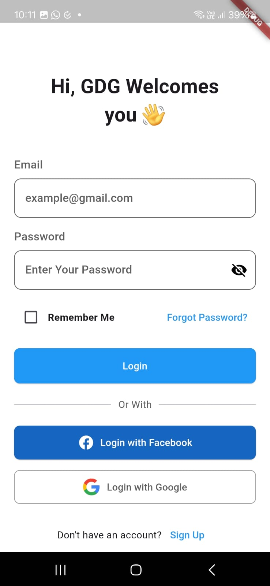
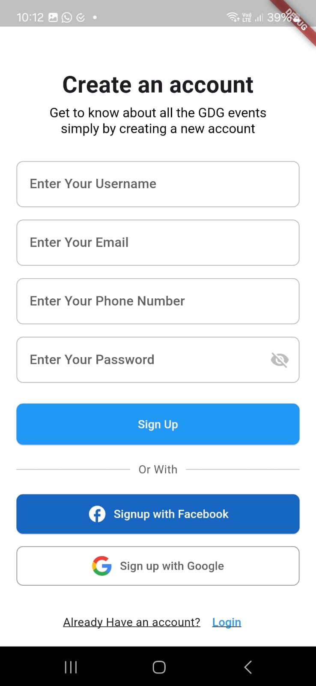
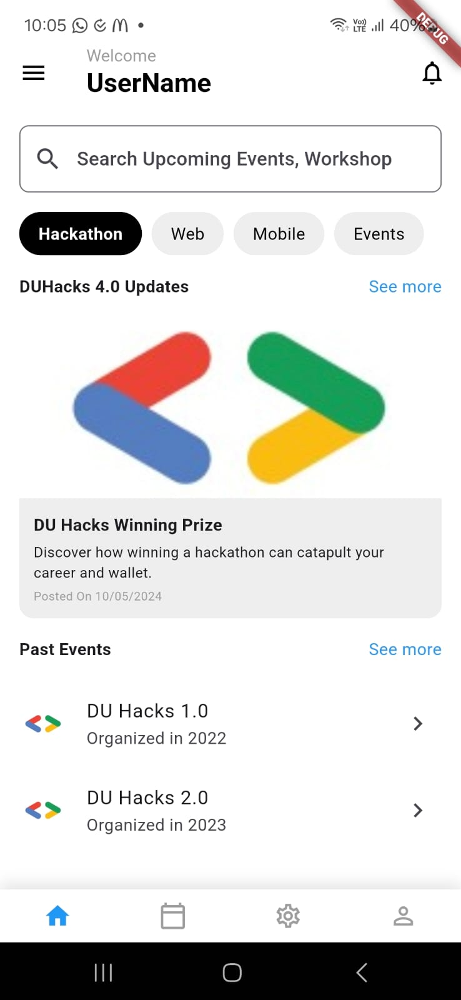
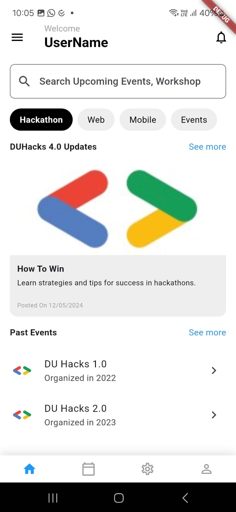

# GDG Login App - Flutter UI

This project is a simple Flutter UI application for managing events and hackathons as part of the GDSC (Google Developer Student Clubs) team. The app features login, signup, and home screens, providing a modern and responsive user interface.

## Features

- **Login & Signup UI:** A clean and user-friendly interface for logging in and signing up with email/password, as well as social media integrations (Facebook and Google).
- **Event Cards:** Display upcoming and past events with images, dates, and descriptions.
- **Search Functionality:** Users can search for upcoming events and workshops.
- **Filter with Chips:** Users can filter events based on categories like Hackathon, Web, Mobile, etc.
- **Drawer Menu:** A side menu with multiple sections like Home, Profile, About Us, and more.
- **Bottom Navigation Bar:** Provides easy navigation between the Home, Calendar, Settings, and Profile screens.

## Screens

1. **Login Screen:**
   - Allows users to log in with email and password.
   - Includes a 'Remember Me' checkbox and options for social login (Facebook, Google).
   - A 'Forgot Password' feature is included.

2. **Signup Screen:**
   - Allows new users to sign up with email, password, and other details.
   - Social signup options for Facebook and Google.
   - Navigation to the login page for existing users.

3. **Home Screen:**
   - Displays upcoming events as cards.
   - Past events section for viewing previous hackathons and workshops.
   - A search bar and filter options are provided for users to look for specific events.
     
## Screenshots

### Login Screen


### Signup Screen


### Home Screen




## Folder Structure

```bash
lib/
├── main.dart             # Entry point for the app
├── home_screen.dart      # UI for the home screen
├── login_screen.dart     # UI for the login screen
└── signup_screen.dart    # UI for the signup screen


